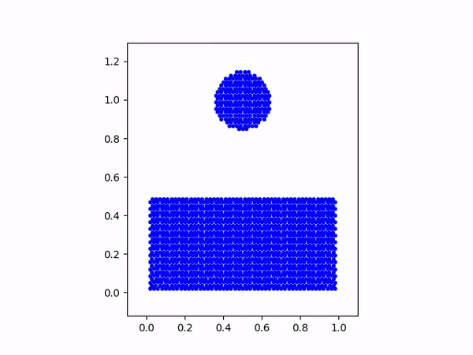

# jetFramework

I am writing this framework to understand how a large scale C++ project is setup and developed.

Dependencies are included in the repo. I am using Clang compiler to compile the project. Currently, it only supports Windows.

## Output of Examples Rendered using MatPlotLib
### 2D SPH Water Drop Example Output:
